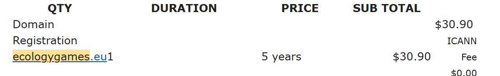

+++
title = '20241201_Ecology Games Domain Purchased!'
date = 2024-12-01T11:11:24Z
draft = false
categories = 'News'
tags = ['news']
series = 'news' # Optional, make this 'news' add this if you want it to appear in the headline section
[params]
  author = 'Paidia'
+++
Buying a .eu domain is tricky if you are in the UK!
<!--more-->
Even though, as an Irish Citizen, I can register a .eu domain, I struggled to buy the domain on dreamhost because they don't expose all of the requried addresses explicitly.

I was being rejected because my billing address was in the UK.

I found a different registrare (namecheap) who were more explicit about the various addresses and thus I was able to register the domain.

We have the domain for about 5 years and we can revisit then!

